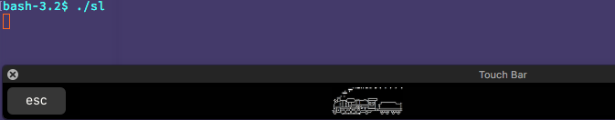

SL on touch bar
===============

Run the SL on the touch bar of your MacBook Pro!

You can use your own image of SL by specifying the path to the image to the sl command argument, or SL_IMAGE environmental variable.

## Demo

## About SL command

[Original SL command](https://github.com/mtoyoda/sl) is a joke command to show
SL on the terminal when you mistype 'ls'.
